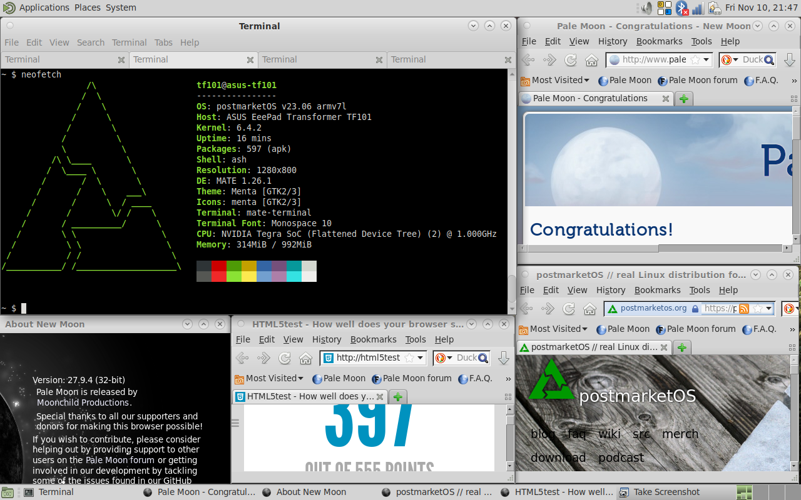
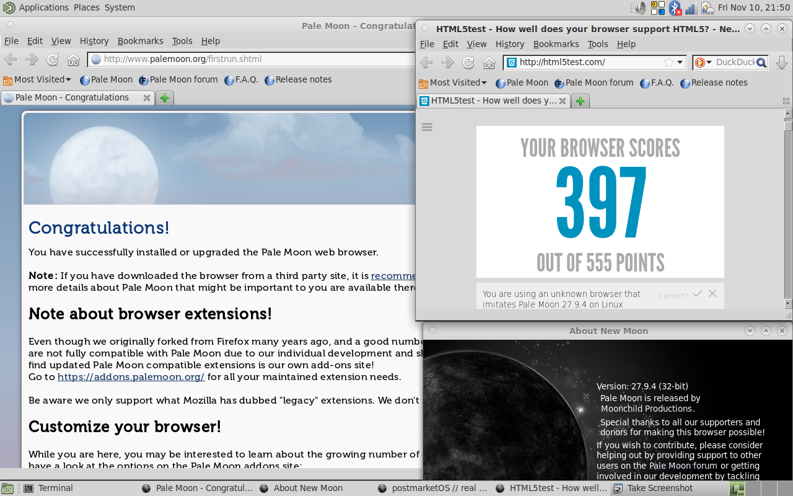

# Unofficial Palemoon for non-NEON systems

⚠️ **Disclaimer**: The binaries produced using these build scripts are **not** an official Palemoon product! You will *NOT* have any form of user support. Binaries will not be redistributed in any type or form, I only provide the build scripts.

---

This is a completely unofficial (old!) Palemoon test build for non-NEON systems for PostmarketOS / Alpine Linux, in order to have a middle-ground browser between Netsurf (no JS, basic HTML and CSS features) and Firefox (resource hog on 1GB RAM system, and Alpine's firefox builds do not work either on non-NEON systems).

It is focused on the Tegra 2 systems, like the Asus Transformer TF101, but should work on any available architecture (`x86, armhf and riscv64 not tested`).

## Credits
Credits to [https://github.com/tanertas/aports/tree/palemoon/testing/palemoon](tanertas), the original source where I picked most of the `APKBUILD` files.

## Build
For PostmarketOS 23.06, I just select the `v23.06` branch with `pmbootstrap` and leave the rest as default.

Assuming your `pmbootstrap` directory is clean, has `$HOME/.local/var/pmbootstrap` as the specified location, you are in the correct version branch and your host is an `x86_64` machine, I do:

```
git clone --depth=1 https://github.com/antonialoytorrens/palemoon-noneon.git /tmp/palemoon-noneon

cp -r /tmp/palemoon-noneon/* $HOME/.local/var/pmbootstrap/cache_git/pmaports/main
rm -r $HOME/.local/var/pmbootstrap/cache_git/pmaports/main/assets
rm -r $HOME/.local/var/pmbootstrap/cache_git/pmaports/main/README.md

# For armv7:
pmbootstrap --no-cross build --force palemoon --arch=armv7

# For x86_64:
pmbootstrap build --force palemoon
```

## Status
- Builds successfully and works on Alpine Linux 3.18 / PostmarketOS 23.06.

## Screenshots
### PostmarketOS 23.06 / Alpine 3.18




## TODO
Try to build a more recent Palemoon version.